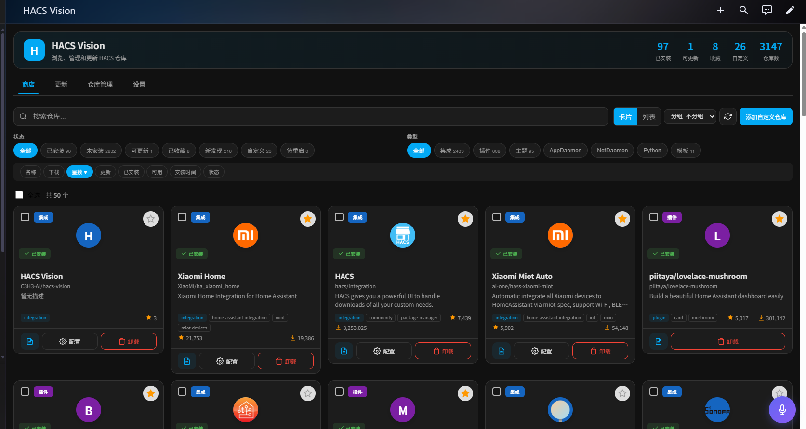
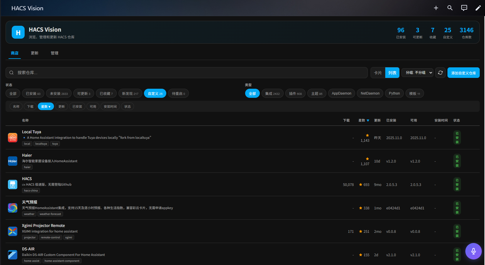
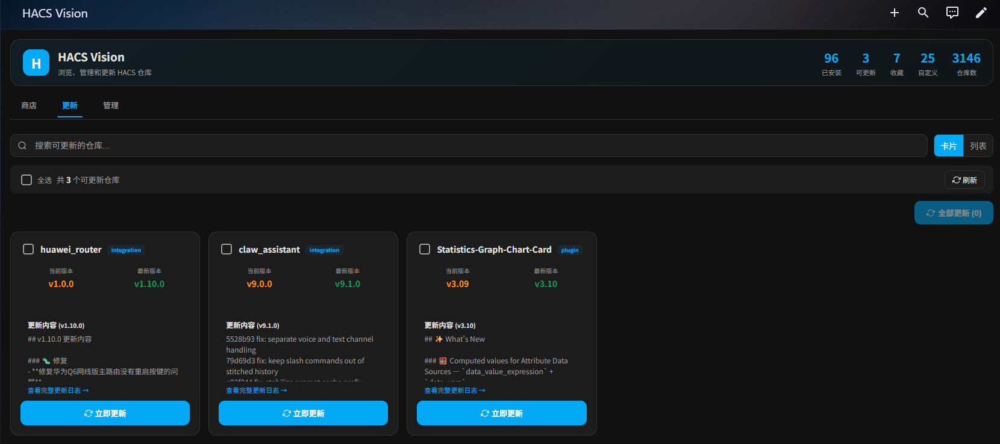
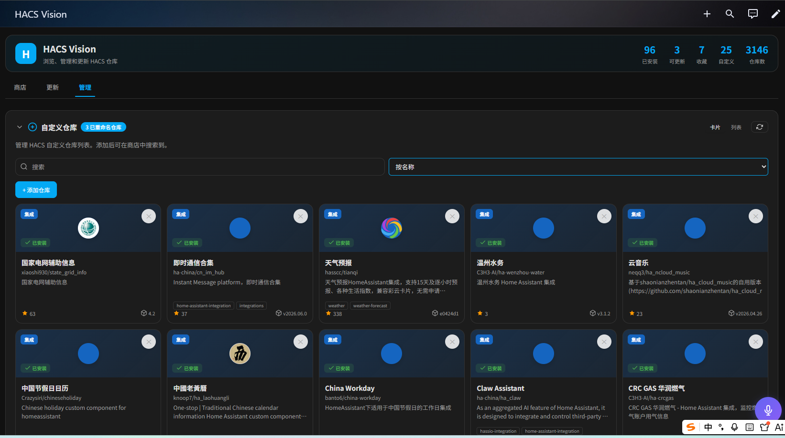
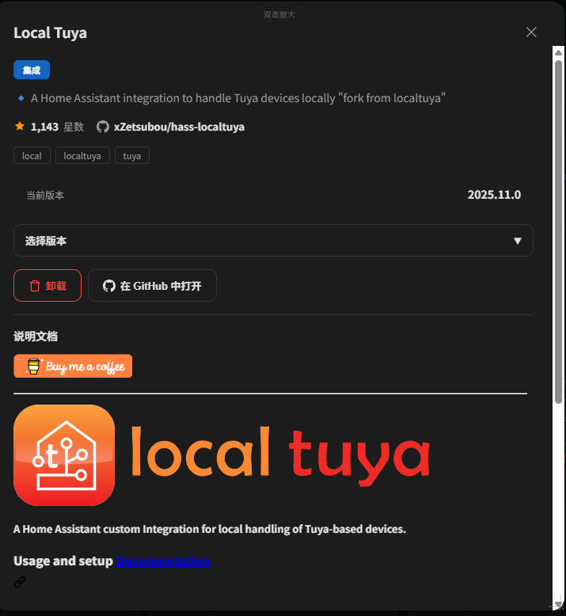
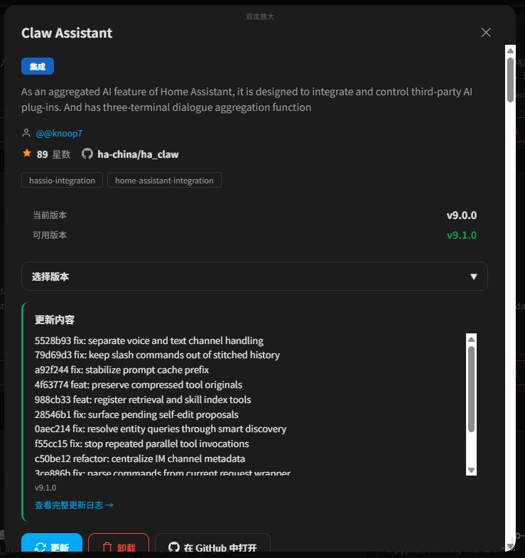

# HACS Vision

一个现代化的 HACS 视觉界面，提供卡片/列表双视图、自定义仓库标识、主题适配等增强功能。

## 🎯 为什么开发这个项目？

官方 HACS 的界面功能比较基础，缺少一些实用的功能：
- 只有列表视图，缺少更直观的卡片视图
- 自定义仓库没有明显标识，容易混淆
- 没有收藏功能，常用的仓库不方便找到
- 没有批量更新功能，升级多个仓库需要逐个操作
- 没有备份与恢复功能，重装 HA 后需要重新配置

HACS Vision 就是为了解决这些问题而开发的！

## ✨ 功能特性

### 官方功能兼容
- 完整支持 HACS 的 6 种仓库类型（集成、面板、主题、Python 脚本、AppDaemon、模板）
- 与官方 HACS 相同的筛选、排序、搜索功能
- 详细的仓库信息展示与详情页

### 增强功能
- 🎨 **卡片/列表双视图**：灵活切换，更符合浏览习惯
- 📦 **自定义仓库标识**：橙色边框 + 标签，一眼识别自定义仓库
- 🏷️ **Topics 标签**：显示仓库的 GitHub Topics，快速了解仓库主题
- 👥 **作者信息**：展示仓库作者头像与名称
- 🔄 **批量更新**：一键更新所有可升级的仓库
- ⭐ **收藏功能**：收藏你常用的仓库
- 📊 **统计面板**：概览仓库数量与更新
- 📦 **备份与恢复**：导出/导入 HACS 配置与已安装仓库
- 📋 **Changelog 预览**：查看仓库的更新历史
- ⚙️ **管理功能**：归档、重命名、忽略仓库

## 📸 效果图

## 🚀 安装

### 方法 1：通过 HACS（推荐）
1. 打开 HACS
2. 进入「自定义仓库」
3. 添加 `C3H3-AI/hacs-vision`，类别选「集成」
4. 在「集成」里找到并安装 HACS Vision

### 方法 2：手动安装
1. 将 `custom_components/hacs_vision` 目录复制到你的 HA 配置目录
2. 重启 HA
3. 在「集成」里添加 HACS Vision

## 📖 使用

1. 安装后，HA 侧边栏会出现「HACS Vision」入口
2. 点击进入，即可体验增强界面
3. 右上角可切换「卡片/列表」视图
4. 顶部有统计条，点击可快速筛选仓库类型

## 📝 更新日志

### v1.1.0
- 修复自定义仓库橙色标识不显示的问题（is_custom 检测 bug）
- 修复待重启（Pending Restart）状态不准的问题
- 优化：自定义仓库检测同时读取 HACS 配置和默认仓库列表

### v1.0.0
- 初始正式版本发布
- 完整的功能对比与实现
- 添加作者信息与 Topics 标签
- 添加自定义仓库橙色标识

## 📄 许可证

MIT License

## 🤝 贡献

欢迎提交 Issue 和 Pull Request！
