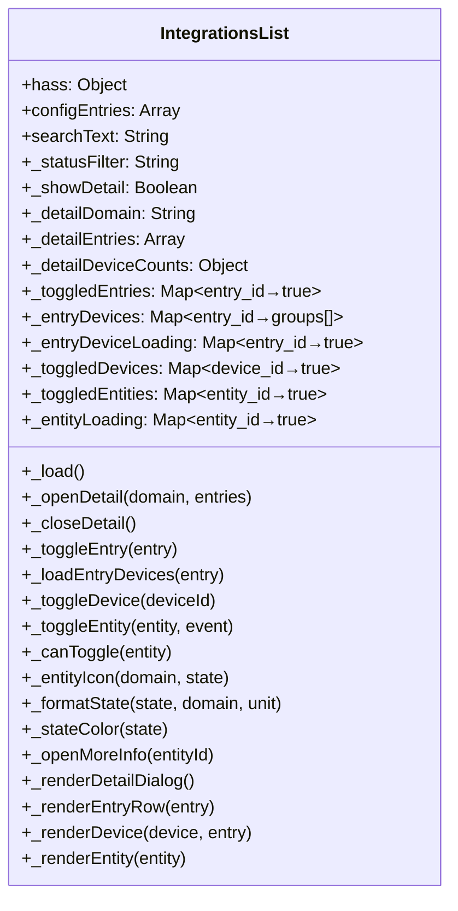
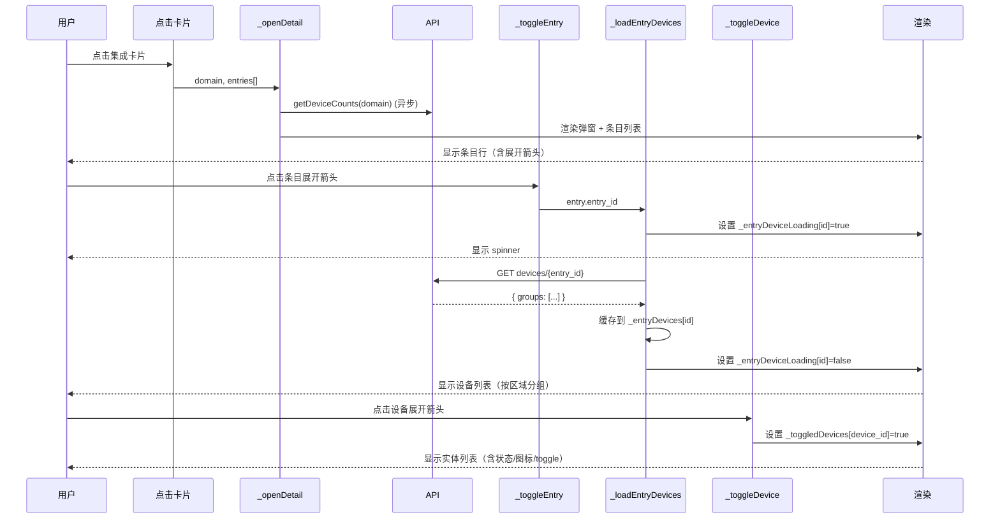
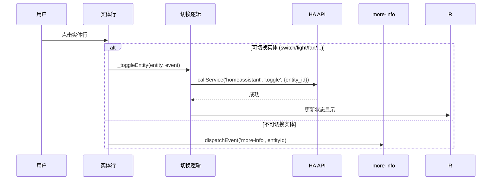

# 🏗️ 系统架构设计 — 集成管理弹窗树形重构

**架构师**: 高见远
**日期**: 2026-06-14
**基准**: 基于 `a38a25c` (wip: integration tree dialog)

---

## 1. 实现方案概述

### 1.1 策略：最小增量变更

本项目使用 Rollup + LitElement + 单文件面板输出，源文件分模块存储。重构策略是**修改现有 `integrations-list.js`，删除 `device-view.js`**，而非重写。

**核心思路**：
- `integrations-list.js` 已部分实现树形展开基础（`_toggleEntry`/`_toggledEntries`），只是没渲染设备子节点
- 将 `device-view.js` 的实体渲染逻辑（`_entityIcon`/`_formatState`/`_canToggle`/`_toggleEntity`）内联到 `integrations-list.js`
- 删除 `device-view.js` 文件 + 移除 CSS 显示引用
- 完全在 `_renderDetailDialog` → `_renderEntryRow` 层级内完成所有渲染

### 1.2 框架选型

| 项 | 选择 | 原因 |
|---|------|------|
| 框架 | LitElement 3.x | 已有，不变 |
| 构建 | Rollup + Terser | 已有，不变 |
| 前端组件库 | 无外部 UI 库 | LIT 原生，保持包体积 |
| 状态管理 | Lit reactive properties | 已有模式 |
| 图标 | Emoji + SVG | 与现有一致 |

---

## 2. 文件清单

| # | 文件 | 操作 | 说明 |
|:-:|------|:----:|------|
| F1 | `frontend_src/src/views/integrations-list.js` | **修改** | 主变更文件：添加设备/实体树渲染 |
| F2 | `frontend_src/src/views/device-view.js` | **删除** | 废弃，功能内联到 integrations-list |
| F3 | `frontend_src/src/views/management.js` | **删除引用** | 移除 `hacs-vision-device-view` 的引用 |
| F4 | `custom_components/hacs_vision/frontend/panel.js` | **构建产物** | `npm run build` 产出 |

---

## 3. 数据结构和接口

### 3.1 状态类图



### 3.2 后端 API 返回结构（不变）

```typescript
// GET /api/hacs_vision/devices/{entry_id} → 当前返回格式
interface DeviceGroup {
  area: string;        // 区域名
  devices: Device[];
}
interface Device {
  device_id?: string;
  entity_id?: string;
  name: string;
  model?: string;
  entities: Entity[];
}
interface Entity {
  entity_id: string;
  name?: string;
  domain: string;
  state?: string;
  unit?: string;
  disabled: boolean;
}
```

### 3.3 新增/修改的状态

```javascript
// 在 IntegrationsList 中新增:
// _toggledEntities: { [entity_id]: true/false } — 实体展开状态（当前不需要折叠，但保留以备未来）
// 不需要新增本质状态，全部复用现有结构
```

---

## 4. 程序调用流程

### 4.1 打开集成详情弹窗 → 展开条目 → 展开设备



### 4.2 实体交互流程



---

## 5. 任务列表

### 任务依赖图

```
Task 1 → Task 2 → Task 3 → Task 4 → Task 5 → Task 6
                 ↘         ↗
              (并行: CSS 样式)
```

### 详细任务

| # | 任务 | 文件 | 依赖 | 描述 |
|:-:|------|:----:|:----:|------|
| 1 | **条目行增加展开箭头，删除「设备」按钮** | `integrations-list.js` | — | `_renderEntryRow`：移除 `.entry-btn.device` 按钮；在条目前加箭头 svg；展开状态箭头旋转 |
| 2 | **设备树渲染：设备行 + 实体行** | `integrations-list.js` | 1 | 新增 `_renderDevice(groups, entry)` 和 `_renderEntity(entity)` 方法；渲染在 `_renderEntryRow` 中展开状态后 |
| 3 | **实体渲染/交互：图标、状态、切换、more-info** | `integrations-list.js` | 2 | 从 `device-view.js` 移植 `_entityIcon`/`_formatState`/`_stateColor`/`_canToggle`/`_toggleEntity`/`_openMoreInfo` |
| 4 | **树形 CSS 样式** | `integrations-list.js` | 1,2 | 新 CSS 类：`.tree-arrow` / `.tree-arrow.open` / `.device-row` / `.device-header` / `.device-arrow` / `.entity-row` / `.entity-icon` / `.entity-state` / `.entity-toggle` / `.entity-more`；适配移动端 |
| 5 | **删除 device-view.js + 清理引用** | `device-view.js`, `management.js` | 1~4 | 删除文件；检查 `management.js` 中所有引用 `hacs-vision-device-view` 的代码，删除 |
| 6 | **构建验证** | — | 5 | `cd frontend_src && npm run build`，确认无错误，检查产物大小 |

### 实现顺序

1. **Task 1** → **Task 4** (并行) → **Task 2** → **Task 3** → **Task 5** → **Task 6**

---

## 6. 依赖包

无需新增依赖。现有依赖：

| 包 | 版本 | 用途 |
|---|:----:|------|
| lit | ^3.0.0 | Web 组件框架 |
| rollup | ^4.0.0 | 构建打包 |
| @rollup/plugin-node-resolve | ^15.0.0 | 模块解析 |
| @rollup/plugin-terser | ^0.4.0 | 代码压缩 |
| dompurify | ^3.4.8 | XSS 防护（已引入） |

---

## 7. 共享知识（跨文件约定）

### 7.1 实体渲染复用约定

从 `device-view.js` 移植到 `integrations-list.js` 的函数（保持签名一致）：

| 函数 | 签名 | 说明 |
|------|------|------|
| `_entityIcon(domain, state)` | `(string, string) => string` | 返回实体 emoji 图标 |
| `_stateColor(state)` | `(string) => string` | 根据状态返回 CSS 颜色值 |
| `_formatState(state, domain, unit)` | `(string, string, string) => string` | 格式化状态显示文本 |
| `_canToggle(entity)` | `(Object) => boolean` | 判断实体是否可切换 |
| `_toggleEntity(entity, event)` | `(Object, Event) => Promise<void>` | 执行实体开关操作 |
| `_openMoreInfo(entityId)` | `(string) => void` | 打开 HA more-info 弹窗 |

### 7.2 命名约定

- 展开状态变量：`_toggledEntries`(条目展开) / `_toggledDevices`(设备展开)
- 数据缓存：`_entryDevices`(设备列表缓存) / 不需要缓存实体（从设备数据中直接取）
- CSS 类前缀：`tree-*` (树容器)、`entry-*` (条目行)、`device-*` (设备行)、`entity-*` (实体行)

### 7.3 删除 device-view.js 的影响范围

1. `integrations-list.js` — 不再 `<style>` 引用 `device-view` 样式，不再 dispatch `'show-device-view'` 事件
2. `management.js` — 需要移除 `import('./device-view.js')` 或类似引用
3. `panel.js`(构建产物) — 重新构建后自动移除
4. 检查 `management.js` 中对 `hacs-vision-device-view` 的使用

---

## 8. 待明确事项

| # | 事项 | 状态 |
|:-:|------|:----:|
| A1 | 确认 management.js 中 device-view 的引用方式 | ⏳ 需检查 |
| A2 | 设备展开后实体是否按区域分组（device-view 现有逻辑是区域分组） | ✅ 按现有逻辑，保持区域分组 |
| A3 | 实体过多时是否需要分页 | ❌ 不需要，弹窗内滚动即可 |
| A4 | 展开全部/折叠全部是否作用于设备级别 | ✅ 作用于设备级别（`_toggledDevices`） |
