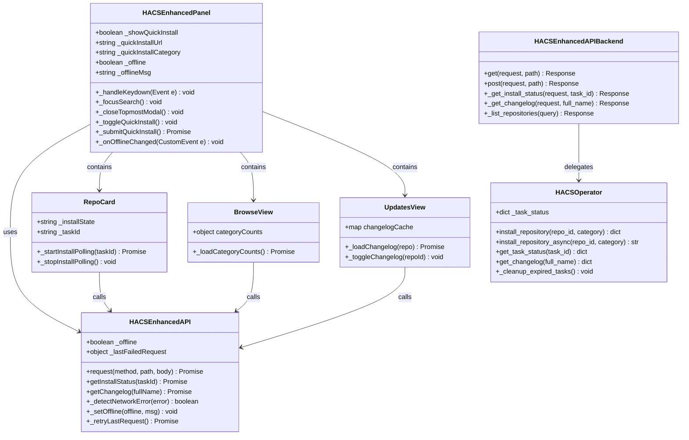
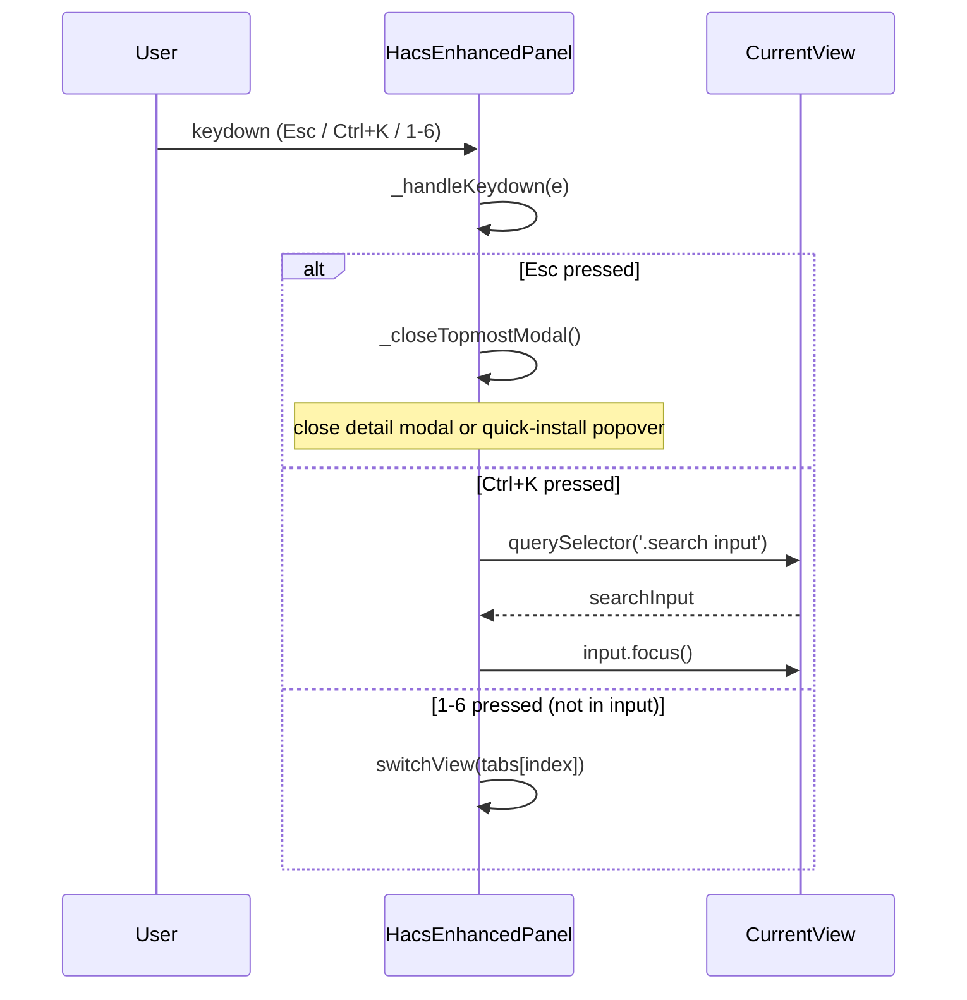
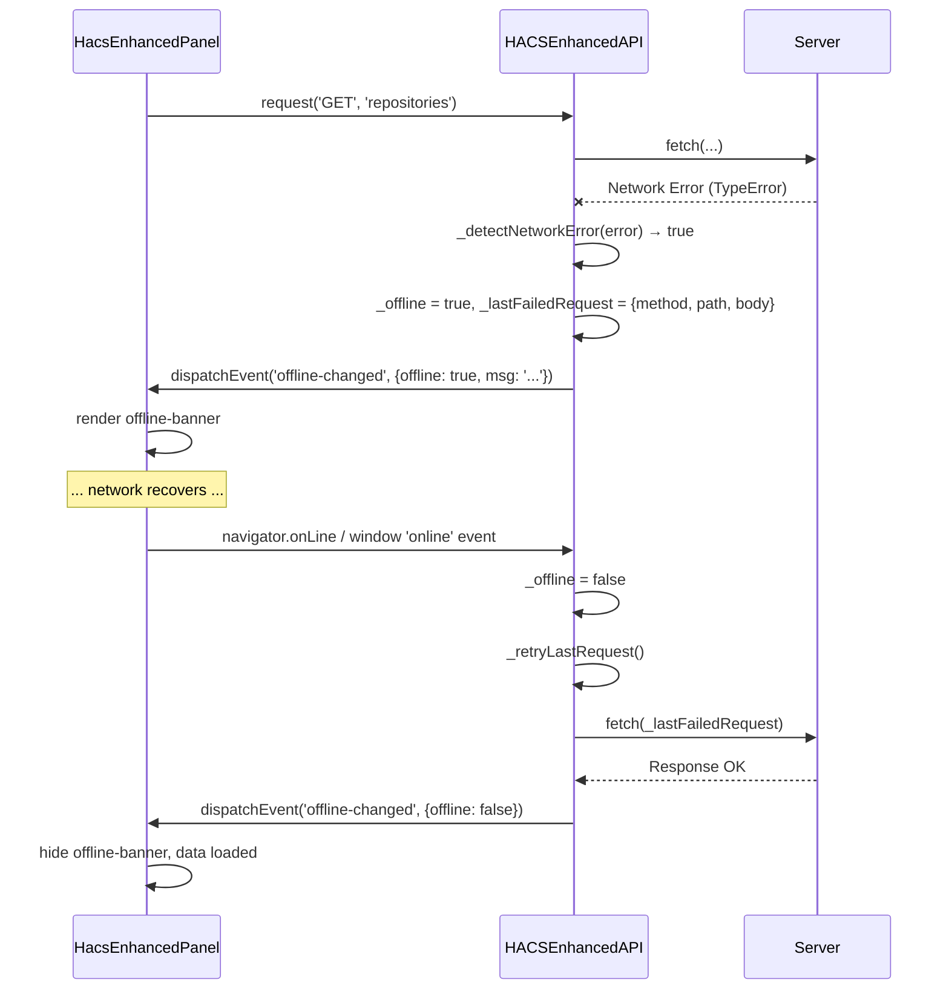
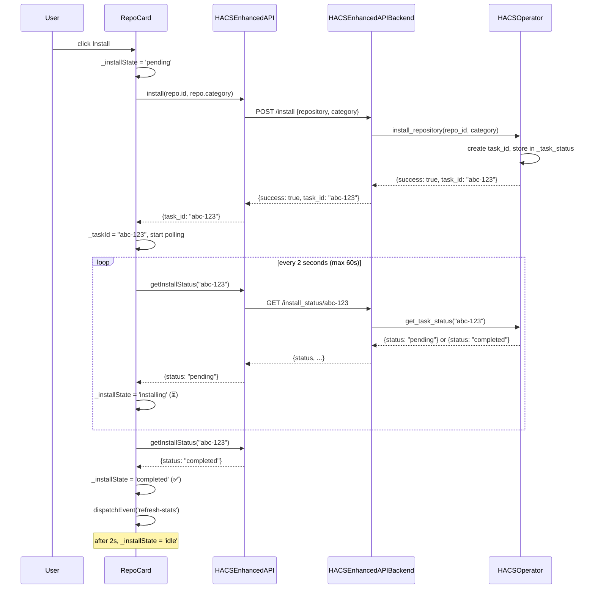
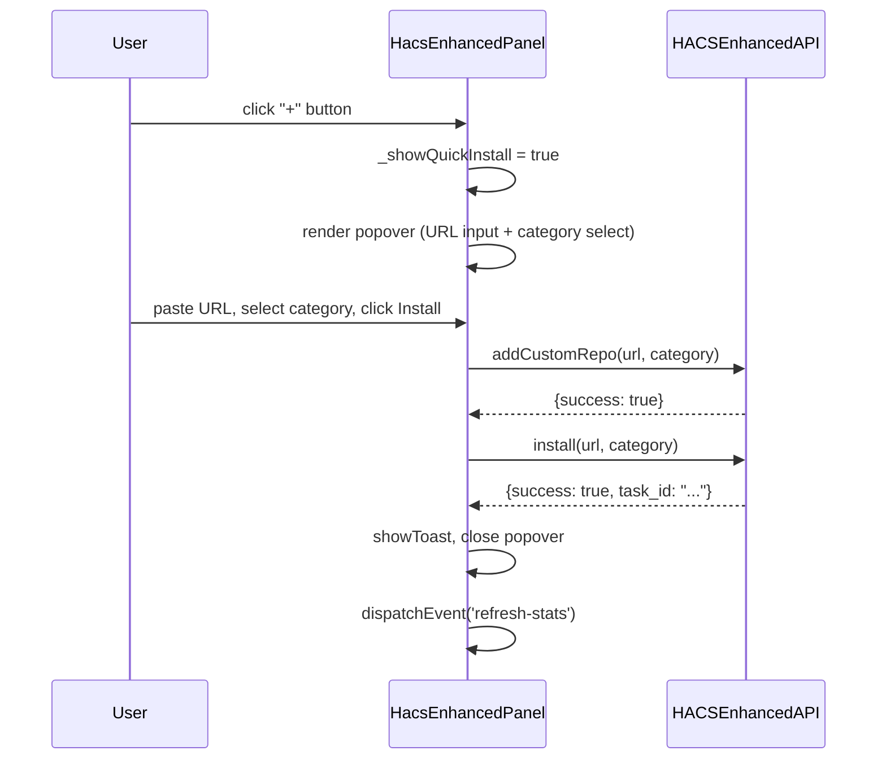
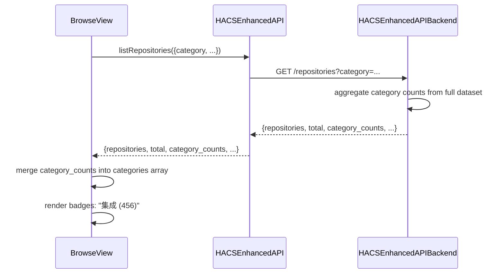
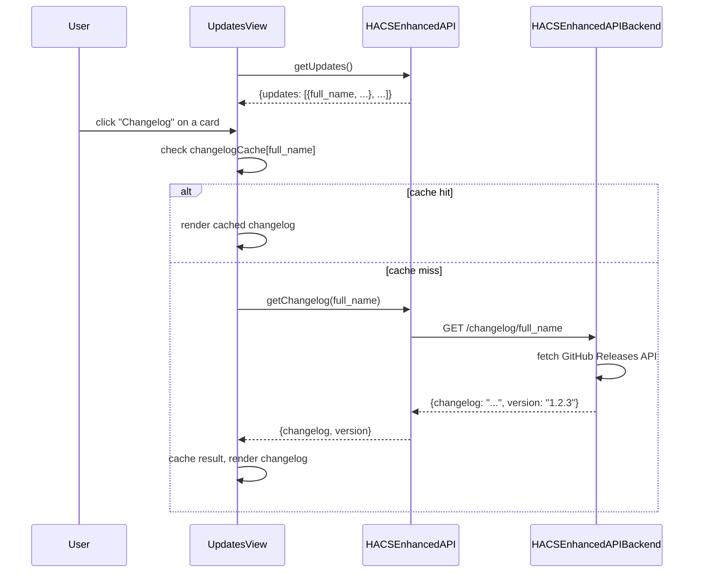
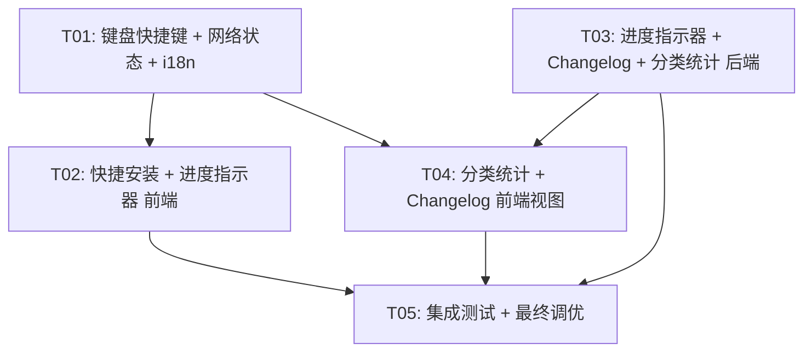

# HACS Enhanced — 增量优化架构设计

> 版本: v1.0 | 日期: 2025-07 | 架构师: Bob

---

## Part A: 系统设计

### 1. 实现方案

#### F1 键盘快捷键（P0）

**前端策略**: 在 `HacsEnhancedPanel` 的 `connectedCallback` 注册全局 `keydown` 监听器，在 `disconnectedCallback` 中移除。使用事件委托模式，由面板统一处理。

| 快捷键 | 行为 | 实现位置 |
|--------|------|---------|
| Esc | 关闭当前模态框（detail modal / quick-install popover） | `hacs-enhanced-panel.js` → `_handleKeydown()` |
| Ctrl+K / Cmd+K | 聚焦当前视图的搜索框 | `hacs-enhanced-panel.js` → `_focusSearch()` |
| 1-6 | 切换 Tab（Browse→1, Favorites→2, Installed→3, Updates→4, Config→5, Backup→6） | `hacs-enhanced-panel.js` → `_handleKeydown()` |

**注意**: 键盘监听仅在面板获得焦点时生效（使用 `this.tabIndex = 0`），避免与 HA 其他面板冲突。搜索框聚焦时禁用数字键切换 Tab。

**后端**: 无变更。

#### F2 网络状态感知（P0）

**前端策略**: 拦截 `api.js` 的 `request()` 方法，检测网络失败模式（`TypeError: Failed to fetch` / `net::ERR_` / status 0），设置全局 `_offline` 状态并渲染顶部提示条。恢复后自动重试最后一次失败的请求。

- `api.js` 新增 `_offline: false` 和 `_lastFailedRequest: null` 内部状态
- `request()` catch 块中判断网络错误 → 设 `_offline = true` → 触发 `offline-changed` 事件
- `hacs-enhanced-panel.js` 监听该事件，渲染/隐藏 `.offline-banner`
- `navigator.onLine` + `window.online/offline` 事件作为辅助检测
- 恢复时自动调用 `_retryLastRequest()`

**后端**: 无变更。现有 API 已有完善的错误处理（network_error, rate_limited 等）。

#### F3 进度指示器（P1）

**前端策略**: 在 `api.js` 新增 `getInstallStatus(taskId)` 方法。安装/更新操作触发后进入轮询模式。

状态流转:
```
[安装] → POST /install → 返回 {task_id} → 轮询 GET /install_status/{task_id}
  → {status: "pending"} → 按钮显示 ⏳ 安装中...
  → {status: "completed"} → 按钮显示 ✅ 已完成 → 2s后恢复原态
  → {status: "failed"} → 按钮显示 ❌ 失败 → Toast 提示
```

**后端策略**: 在 `api.py` 新增 `install_status/{task_id}` GET 路由。在 `hacs_operator.py` 中 `install_repository` / `update_repositories` 返回 `task_id`，由 HA 的 `async_create_task` + 内存状态字典追踪。

- `hacs_operator.py` 新增 `_task_status: dict[str, dict]` 和 `install_repository_async()` 方法
- `install_repository()` 改为先创建 task 记录再 `async_create_task` 执行实际安装
- `get_task_status(task_id)` 返回当前状态

#### F4 快捷安装入口（P1）

**前端策略**: 在 Header 右侧 stats 区域前新增 "+" 按钮，点击弹出浮层（popover）。

浮层内容:
- URL 输入框（支持粘贴 GitHub 链接）
- 分类下拉选择（默认 integration）
- 安装按钮（复用 F3 进度指示器）

实现: `hacs-enhanced-panel.js` 新增 `_showQuickInstall: false` 状态和 `_quickInstallUrl/_quickInstallCategory` 属性。浮层用绝对定位，点击外部关闭。

**后端**: 复用现有 `POST /config/custom` + `POST /install` 两步流程，无需新增 API。

#### F5 分类统计数字（P1）

**前端策略**: `browse.js` 的 categories 数组从硬编码改为动态获取，每个 category 旁显示数量 badge。

**后端策略**: `_list_repositories` 返回新增 `category_counts` 字段。在 `api.py` 的 `_list_repositories` 中，对全量数据做一次 category 聚合计数，附加到响应体。

```json
{
  "repositories": [...],
  "total": 1234,
  "category_counts": {
    "integration": 456,
    "plugin": 234,
    "theme": 189,
    ...
  },
  "page": 1,
  "limit": 50
}
```

#### F6 Changelog 预览（P1）

**前端策略**: `updates.js` 卡片中新增 changelog 摘要区域。默认折叠，点击展开。

**后端策略**: 新增 `GET /changelog/{full_name}` 路由，从 GitHub Releases API 获取最新 release body。

- `api.py` 新增 `_get_changelog()` 方法
- `hacs_operator.py` 新增 `get_changelog()` 辅助方法
- 返回: `{changelog: "markdown string", version: "1.2.3"}` 或 `{changelog: null}`

---

### 2. 文件列表

```
# 后端 (Python)
custom_components/hacs_enhanced/
├── api.py                    # [修改] 新增 install_status/changelog 路由、_list_repositories 返回 category_counts
├── hacs_operator.py          # [修改] 新增 task_status 追踪、install_repository_async、get_changelog
├── const.py                  # [修改] 新增 INSTALL_STATUS_TTL 常量

# 前端 (JavaScript)
frontend_src/src/
├── hacs-enhanced-panel.js    # [修改] 键盘快捷键、网络状态条、快捷安装浮层、搜索框聚焦
├── api.js                    # [修改] 网络状态感知、getInstallStatus、getChangelog、category_counts 处理
├── i18n.js                   # [修改] 新增所有功能的 i18n 键值
├── shared/
│   └── styles.js             # [修改] 新增 offline-banner、quick-install、progress 按钮样式
├── views/
│   ├── browse.js             # [修改] 动态 category_counts 显示
│   └── updates.js            # [修改] changelog 预览区域
└── components/
    └── repo-card.js          # [修改] 安装/更新按钮状态流转（进度指示器）
```

---

### 3. 数据结构与接口



---

### 4. 程序调用流程

#### 4.1 键盘快捷键流程



#### 4.2 网络状态感知流程



#### 4.3 进度指示器流程



#### 4.4 快捷安装流程



#### 4.5 分类统计数字流程



#### 4.6 Changelog 预览流程



---

### 5. 待明确事项

| # | 问题 | 假设/建议 |
|---|------|----------|
| 1 | HACS 内部 `async_install` 是同步等待还是异步返回？ | 假设是 await 阻塞的，因此需要 `async_create_task` 实现后台执行 + task_id 轮询 |
| 2 | GitHub Releases API 的 rate limit 与 README API 共享额度？ | 是的，共用 5000/h（认证）或 60/h（未认证）。changelog 建议加缓存 |
| 3 | 进度指示器轮询最大时间？ | 建议 120 秒超时，之后标记 `timeout` 状态 |
| 4 | 快捷安装的 URL 是否支持非 GitHub 源？ | 复用现有 `add_custom_repo` 逻辑，支持 HACS 兼容的任何 URL |
| 5 | 键盘快捷键是否需要用户可配置？ | V1 暂不支持，硬编码快捷键方案 |
| 6 | `install_repository` 是否真的需要 task_id 机制？ | 若 HACS `async_install` 实际执行很快（<3s），可简化为前端定时 3s 后刷新列表，无需轮询。建议先实现简单版本（setTimeout 刷新），保留 task_id 扩展接口 |

---

## Part B: 任务分解

### 6. 依赖包

```
# 无新增 npm 包 — 所有功能基于现有 lit + dompurify 实现
# 无新增 Python 包 — 使用 aiohttp (HA 内置) 调用 GitHub API
```

---

### 7. 任务列表

#### T01: 基础设施 — 键盘快捷键 + 网络状态感知 + i18n 扩展

**源文件**:
- `frontend_src/src/hacs-enhanced-panel.js` — 注册 keydown 监听器，新增 `_handleKeydown`/`_focusSearch`/`_closeTopmostModal` 方法，新增 `_offline`/`_offlineMsg` 属性，渲染 offline-banner，监听 `offline-changed` 事件
- `frontend_src/src/api.js` — `request()` 方法增加网络错误检测逻辑，新增 `_offline`/`_lastFailedRequest` 内部状态，`_detectNetworkError()` 方法，`_setOffline()` 方法，`_retryLastRequest()` 方法，触发 `offline-changed` 自定义事件
- `frontend_src/src/i18n.js` — 新增全部 6 个功能的 i18n 键值（约 30 个新 key）
- `frontend_src/src/shared/styles.js` — 新增 `.offline-banner`、`.quick-install-popover` 样式（为 T02 预留）

**依赖**: 无

**优先级**: P0

---

#### T02: 快捷安装入口 + 进度指示器（前端）

**源文件**:
- `frontend_src/src/hacs-enhanced-panel.js` — Header 新增 "+" 按钮，`_showQuickInstall`/`_quickInstallUrl`/`_quickInstallCategory` 属性，快捷安装浮层 UI，`_submitQuickInstall()` 方法（调用 addCustomRepo + install）
- `frontend_src/src/components/repo-card.js` — 安装/更新按钮新增 `_installState` 属性（idle/pending/installing/completed/failed），`_taskId` 属性，`_startInstallPolling()`/`_stopInstallPolling()` 轮询方法，按钮状态渲染
- `frontend_src/src/api.js` — 新增 `getInstallStatus(taskId)` 方法

**依赖**: T01（i18n 键值、offline-banner 样式）

**优先级**: P1

---

#### T03: 进度指示器 + Changelog + 分类统计（后端）

**源文件**:
- `custom_components/hacs_enhanced/api.py` — 新增 `GET install_status/{task_id}` 路由 → `_get_install_status()`；新增 `GET changelog/{full_name}` 路由 → `_get_changelog()`；`_list_repositories()` 返回体新增 `category_counts` 字段
- `custom_components/hacs_enhanced/hacs_operator.py` — 新增 `_task_status` 字典，`install_repository()` 改为返回 `task_id` 并后台执行，新增 `install_repository_async()` 内部方法，新增 `get_task_status(task_id)` 方法，新增 `get_changelog(full_name)` 方法（GitHub Releases API），新增 `_cleanup_expired_tasks()` 清理过期任务
- `custom_components/hacs_enhanced/const.py` — 新增 `INSTALL_STATUS_TTL = 300`（5分钟过期）和 `CHANGELOG_CACHE_TTL = 3600`（1小时缓存）

**依赖**: 无（后端可独立开发）

**优先级**: P1

---

#### T04: 分类统计 + Changelog 预览（前端视图层）

**源文件**:
- `frontend_src/src/views/browse.js` — `categories` 数组从硬编码改为支持动态 `count` 属性，`_load()` 方法中提取 `category_counts` 并合并到 categories，渲染分类 Tab 时显示数量 badge
- `frontend_src/src/views/updates.js` — 卡片新增 changelog 摘要区域，`changelogCache` Map，`_loadChangelog(repo)` 方法，`_toggleChangelog(repoId)` 展开/折叠方法，changelog 内容用 `innerHTML` 渲染（经 DOMPurify）
- `frontend_src/src/api.js` — 新增 `getChangelog(fullName)` 方法（带 localStorage 缓存），`listRepositories()` 返回值增加 `category_counts` 字段处理

**依赖**: T01（i18n）、T03（后端 API）

**优先级**: P1

---

#### T05: 集成测试 + 最终调优

**源文件**:
- `frontend_src/src/hacs-enhanced-panel.js` — 调试键盘快捷键在各视图中的行为，确保搜索框聚焦时禁用数字键切换；调试 Esc 在多层模态框场景下的行为（detail modal + quick-install 同时打开时先关闭上层）
- `frontend_src/src/components/repo-card.js` — 验证进度指示器状态流转完整性（网络断开时轮询暂停/恢复、超时处理）
- `frontend_src/src/views/browse.js` — 验证分类统计数字在搜索/过滤场景下的准确性（category_counts 应基于全量数据不受搜索影响）
- `frontend_src/src/views/updates.js` — 验证 changelog 为空时的降级展示、DOMPurify 清理效果
- `custom_components/hacs_enhanced/api.py` — 验证 changelog API 的 rate limit 处理、install_status API 的并发安全

**依赖**: T01、T02、T03、T04

**优先级**: P1

---

### 8. 共享知识

```
# API 约定
- 所有新增 API 路由前缀: /api/hacs_enhanced/
- install_status 路由: GET /api/hacs_enhanced/install_status/{task_id}
- changelog 路由: GET /api/hacs_enhanced/changelog/{full_name}
- _list_repositories 响应新增 category_counts 字段（不受 search/category 过滤影响）
- install/update 响应新增 task_id 字段（当启用异步模式时）

# 前端事件约定
- offline-changed: CustomEvent, detail: {offline: boolean, msg?: string}
- refresh-stats: 已有，安装/更新完成后触发

# 前端状态约定
- RepoCard._installState: 'idle' | 'pending' | 'installing' | 'completed' | 'failed'
- 轮询间隔: 2000ms，最大轮询次数: 60 次（120秒超时）
- changelog 缓存: localStorage, key: hacs_changelog_{fullName}, TTL: 1小时

# 键盘快捷键约定
- 快捷键仅在面板 focus 时生效（panel tabIndex=0）
- input/textarea/select 聚焦时仅响应 Esc 和 Ctrl+K
- Tab 切换映射: 1=Browse, 2=Favorites, 3=Installed, 4=Updates, 5=Config, 6=Backup

# i18n 键值前缀
- 键盘: shortcutEsc, shortcutCtrlK, shortcutTabSwitch
- 网络: offlineBanner, offlineRetry, backOnline
- 进度: installing, installCompleted, installFailed, installTimeout
- 快捷安装: quickInstall, quickInstallUrl, quickInstallCategory, quickInstallBtn
- 分类统计: 直接使用 category 名 + count，如 "集成 (456)"
- Changelog: changelog, changelogLoading, changelogEmpty, changelogError
```

---

### 9. 任务依赖图



**关键路径**: T01 → T02 → T05 或 T01+T03 → T04 → T05

T01 和 T03 可以并行开发（前端基础 vs 后端 API），两者完成后 T04 可接入，最终 T05 统一验证。
